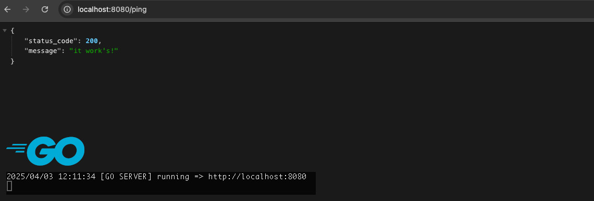

# microservice-monorepo


An example of a microservice in Go according to DDD with EDA in a Kubernetes cluster

## Quick Links
| Link | Description | Credential |
|------|-------------|------------|
|http://localhost:8080 | Local development | - |
|[Link](https://github.com/joho/godotenv) | Go Pkg. for loading env files | joho/godotenv |


## Development
### Overview and local setup
This Go project is structured as follows:

```
├── go-miniserver
│   ├── bin
│   │   └── *                     # Compiled binary goes here after build
│   ├── cmd
│   │   └── api
│   │        ├── main.go          # Entry point of the application
│   │        ├── router.go        # Router setup using net/http
│   │        └── middlewares.go   # Custom middleware definitions
│   ├── internal
│   │   └── handlers
│   │        ├── handlers.go      # Route handler wiring
│   │        └── healthcheck.go   # Healthcheck endpoint logic
│   └── .env                      # Environment variables for local dev
```

**Note:** 
This project uses the standard Go `net/http` package for HTTP routing.
All routes and middleware are defined in `/cmd/api`, and actual handler logic is encapsulated in `/internal/handlers`.

### First time initialisation
As soon as the project has been checked out from the Git repository, all required packages must be installed locally. Start in the root directory of your project:

```
# Install the Go packages
$ go mod tidy
```

### Run the Go Miniserver

```
# Start the server 
$ go run ./cmd/api/*.go

# Alternatively, create build
$ go build -o /bin/main ./cmd/api/*.go
```

## Call the Go Miniserver
### Local Maschine
You should see the following debug output in your terminal:

```
2025/04/03 12:00:15 [GO SERVER] running => http://localhost:8080
```
Open a browser of your choice and enter the following URL:
```
http://localhost:8080/ping
```
You should then see the following debug output on your terminal:
```
{
  "status_code": 200,
  "message": "it work's!"
}
```
and additionally you should get the following debug output on your terminal:
```
2025/04/03 12:01:58 [12:01:58] GET [::1]:12345
```

## Documentation
### For further information 

On my website you will find a complete documentation of the code and all further information under the corresponding headings.

To the official: [Documentation](https://github.com/joho/godotenv)


## Licence
MIT License

Copyright (c) 2025 Gopher

Permission is hereby granted, free of charge, to any person obtaining a copy
of this software and associated documentation files (the "Software"), to deal
in the Software without restriction, including without limitation the rights
to use, copy, modify, merge, publish, distribute, sublicense, and/or sell
copies of the Software, and to permit persons to whom the Software is
furnished to do so, subject to the following conditions:

The above copyright notice and this permission notice shall be included in all
copies or substantial portions of the Software.

THE SOFTWARE IS PROVIDED "AS IS", WITHOUT WARRANTY OF ANY KIND, EXPRESS OR
IMPLIED, INCLUDING BUT NOT LIMITED TO THE WARRANTIES OF MERCHANTABILITY,
FITNESS FOR A PARTICULAR PURPOSE AND NONINFRINGEMENT. IN NO EVENT SHALL THE
AUTHORS OR COPYRIGHT HOLDERS BE LIABLE FOR ANY CLAIM, DAMAGES OR OTHER
LIABILITY, WHETHER IN AN ACTION OF CONTRACT, TORT OR OTHERWISE, ARISING FROM,
OUT OF OR IN CONNECTION WITH THE SOFTWARE OR THE USE OR OTHER DEALINGS IN THE
SOFTWARE.